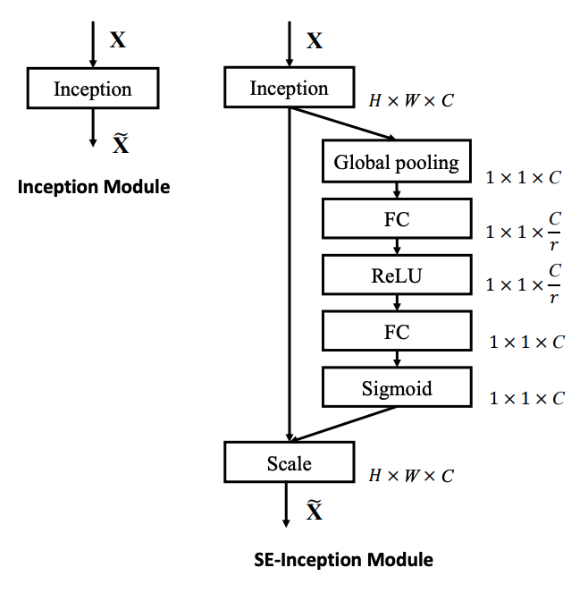

Squeeze and Excitation Networks
=====

## Squeeze and Excitation (SE) Module
<div align="center">
    
  <p>The Squeeze and Excitation (SE) Module [1].</p>
</div>

## Performance

| |Basic CNN|SENet (CNN + SE Module)|
|:---|---:|---:|
|Accuracy|0.99340|0.99350|
|Precision|0.99339|0.99344|
|Recall|0.99329|0.99342|
|F1-Score|0.99334|0.99342|

### Basic CNN
```
Confusion Matrix
[[ 979    0    0    0    0    0    0    1    0    0]
 [   0 1132    0    1    0    0    1    1    0    0]
 [   0    0 1029    0    0    0    0    3    0    0]
 [   0    0    1 1006    0    3    0    0    0    0]
 [   0    0    1    0  975    0    2    0    0    4]
 [   1    0    0    7    0  882    1    0    0    1]
 [   4    2    0    0    0    1  950    0    1    0]
 [   1    3    3    2    0    0    0 1018    1    0]
 [   3    0    1    1    0    1    0    0  966    2]
 [   0    0    0    1    6    2    0    3    0  997]]
Class-0 | Precision: 0.99089, Recall: 0.99898, F1-Score: 0.99492
Class-1 | Precision: 0.99560, Recall: 0.99736, F1-Score: 0.99648
Class-2 | Precision: 0.99420, Recall: 0.99709, F1-Score: 0.99565
Class-3 | Precision: 0.98821, Recall: 0.99604, F1-Score: 0.99211
Class-4 | Precision: 0.99388, Recall: 0.99287, F1-Score: 0.99338
Class-5 | Precision: 0.99213, Recall: 0.98879, F1-Score: 0.99045
Class-6 | Precision: 0.99581, Recall: 0.99165, F1-Score: 0.99372
Class-7 | Precision: 0.99220, Recall: 0.99027, F1-Score: 0.99124
Class-8 | Precision: 0.99793, Recall: 0.99179, F1-Score: 0.99485
Class-9 | Precision: 0.99303, Recall: 0.98811, F1-Score: 0.99056

Total | Accuracy: 0.99340, Precision: 0.99339, Recall: 0.99329, F1-Score: 0.99334
```

### SENet (Basic CNN + SE Module)
```
Confusion Matrix
[[ 977    0    0    0    0    0    1    1    1    0]
 [   0 1131    1    0    0    0    1    0    1    1]
 [   2    0 1027    0    0    0    0    3    0    0]
 [   0    0    0 1008    0    1    0    0    1    0]
 [   0    0    0    0  973    0    5    0    0    4]
 [   1    0    0    5    0  883    3    0    0    0]
 [   1    1    0    0    1    2  952    0    1    0]
 [   0    2    3    1    0    0    0 1020    1    1]
 [   2    0    1    1    0    0    0    1  966    3]
 [   0    0    1    1    4    3    0    1    1  998]]
Class-0 | Precision: 0.99390, Recall: 0.99694, F1-Score: 0.99542
Class-1 | Precision: 0.99735, Recall: 0.99648, F1-Score: 0.99691
Class-2 | Precision: 0.99419, Recall: 0.99516, F1-Score: 0.99467
Class-3 | Precision: 0.99213, Recall: 0.99802, F1-Score: 0.99506
Class-4 | Precision: 0.99489, Recall: 0.99084, F1-Score: 0.99286
Class-5 | Precision: 0.99325, Recall: 0.98991, F1-Score: 0.99158
Class-6 | Precision: 0.98960, Recall: 0.99374, F1-Score: 0.99167
Class-7 | Precision: 0.99415, Recall: 0.99222, F1-Score: 0.99318
Class-8 | Precision: 0.99383, Recall: 0.99179, F1-Score: 0.99281
Class-9 | Precision: 0.99106, Recall: 0.98910, F1-Score: 0.99008

Total | Accuracy: 0.99350, Precision: 0.99344, Recall: 0.99342, F1-Score: 0.99342
```

## Reference
[1] Hu, Jie, et al. (2018). <a href="https://arxiv.org/abs/1709.01507">Squeeze-and-excitation networks.</a> Proceedings of the IEEE conference on computer vision and pattern recognition. 2018.
